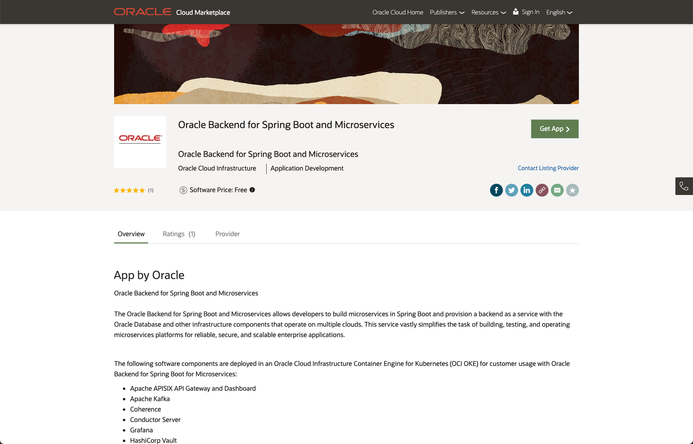
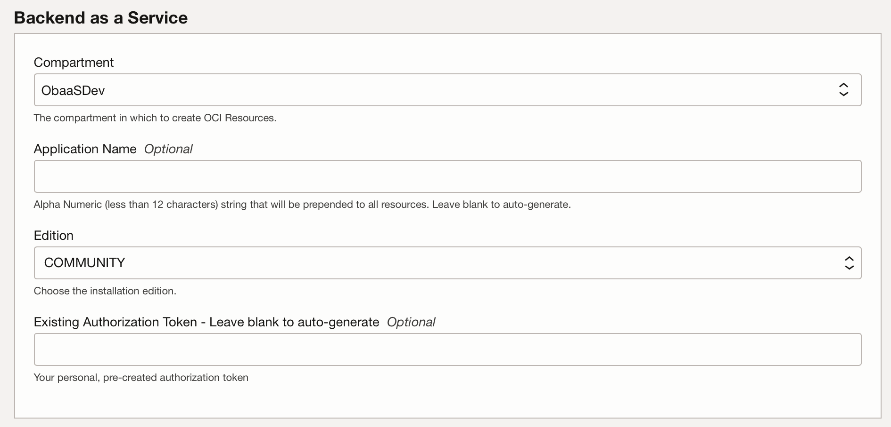
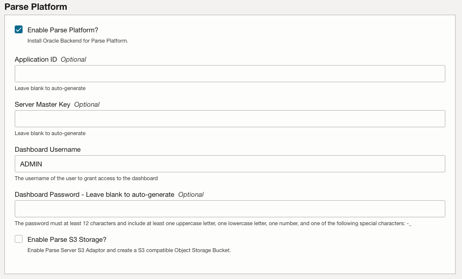
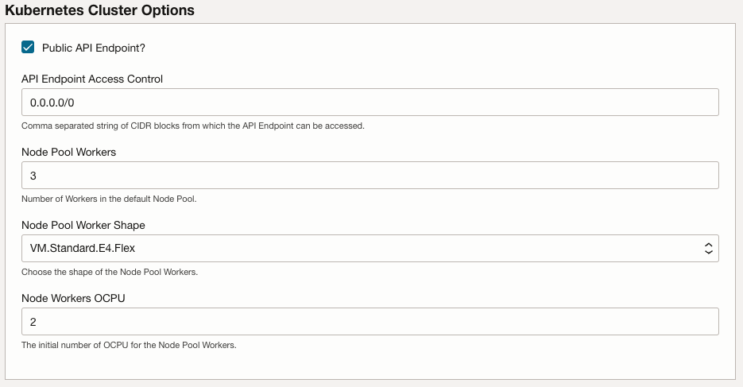
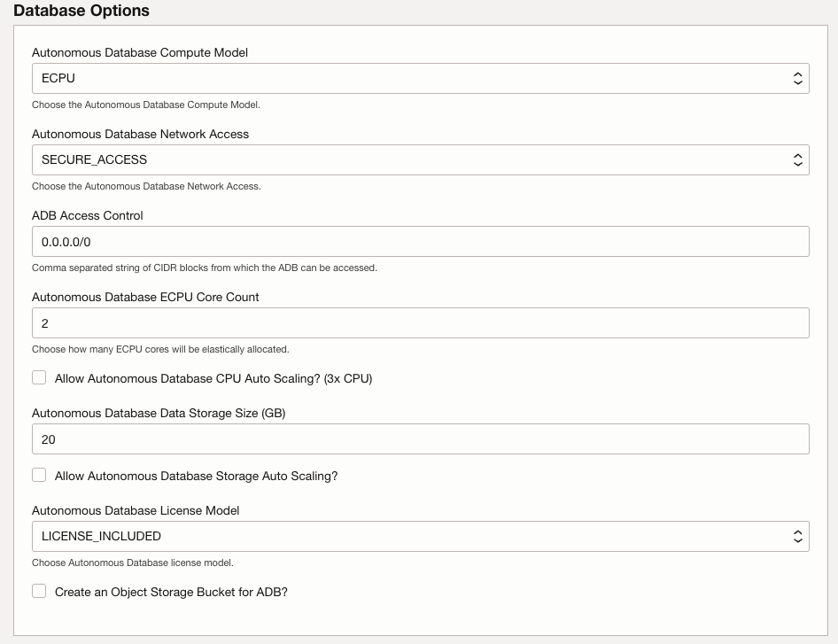
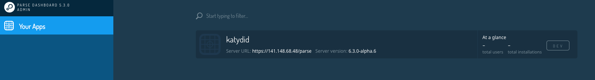
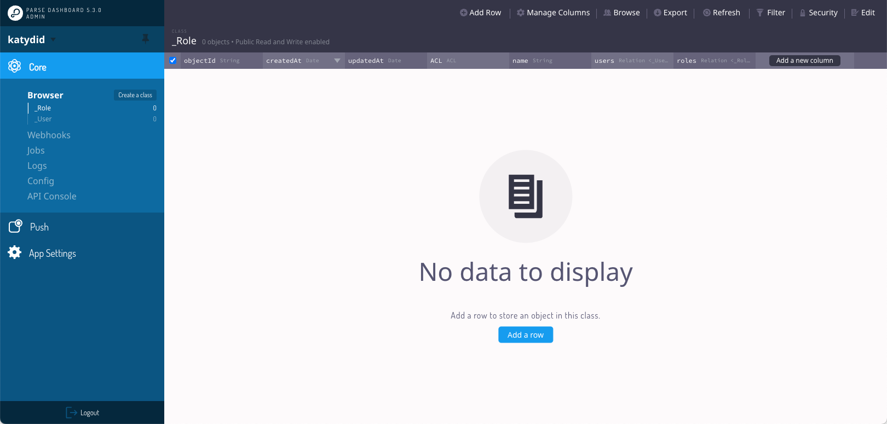

# Provision an instance of Oracle Backend for Spring Boot and Microservices

## Introduction

This lab walks you through the steps to provision an instance of the Oracle Backend for Spring Boot and Microservices, including Parse Platform in the Oracle Cloud. The Oracle Backend for Parse Platform is available separately, or it can be optionally included when installing the Oracle Backend for Spring Boot and Microservices by selecting an option during the installation.

Estimated Time: 30 minutes

### About Oracle Backend for Spring Boot and Microservices

Oracle Backend for Spring Boot and Microservices allows developers to build microservices in Spring Boot and provision a backend as a service with the Oracle Database and other infrastructure components that operate on multiple clouds. This service vastly simplifies the task of building, testing, and operating microservices platforms for reliable, secure, and scalable enterprise applications.

### About Oracle Backend for Parse Platform

Oracle Backend for Parse Platform allows developers to build and deploy mobile applications using Parse mobile APIs, and provision a backend as a service with the Oracle Database and other infrastructure components that operate on multiple clouds. This service vastly simplifies the task of building, testing, and operating a mobile app dev platform for reliable, secure, and scalable enterprise applications. This version includes an Oracle Database storage adapter for Parse (Parse already has MongoDB and Postgres adapters), and a proof of concept of Google Firebase APIs emulated using Parse APIs.

### Objectives

In this lab, you will:

* Provision an instance of Oracle Backend for Spring Boot and Microservices, with Parse Platform included

### Prerequisites

This lab assumes you have:

* An Oracle Cloud account in a tenancy with sufficient quota and privileges to create:
  * An OCI Container Engine for Kubernetes cluster, plus a node pool with three worker nodes
  * A VCN with at least two public IP’s available
  * A public load balancer
  * An Oracle Autonomous Database - Shared instance
  * At least one free OCI Auth Token (note that the maximum is two per user)

## Task 1: Install the Oracle Backend for Spring Boot and Microservices from OCI Marketplace

The Oracle Backend for Spring Boot and Microservices can be installed from OCI Marketplace.

> **Note:** Oracle Backend for Spring Boot and Microservices can also be installed on-premises or in other clouds.

1. Access the Oracle Cloud Infrastructure Marketplace listing

    Open the [OCI Marketplace listing](https://cloudmarketplace.oracle.com/marketplace/en_US/listing/138899911), as shown in the image below:

    

    Click on the **Get App** button.

1. Log into your Oracle Cloud Infrastructure account

    You will be taken to a Sign-In page. Choose they type of account you have and click on the **Sign In** button. If you did not create an account in the **Get Started** lab, you can do so now using the **Sign Up** button.

    

    Sign in to your account as you normally do, using Single Sign-On or Direct Sign-In.

1. Choose the region and compartment

    In the next screen you can choose the region using the pull down in the top right hand corner, and then choose the compartment you want to install into.

    

    Review the terms and restrictions, and then click on the checkbox to accept them. Then, click on **Launch Stack**,

    > **Note:** This Live Lab is tested with **version 1.1.3**. Later versions should work, but earlier versions do not contain all features used in this Live Lab.

1. Review the **Create Stack** page

    Review the details on the **Create Stack** page. You may wish to update the **Name** or add tags. When you are ready, click on **Next**.

    

1. In the **Backend as A Service** Section, fill in the following configuration variables as needed and select **Next**:

    * `Compartment` : Select the compartment where you want to install Oracle Backend for Spring Boot and Microservices.
    * `Application Name` (optional) : A random pet name that will be used as the application name if left empty.
    * `Edition` : Select *COMMUNITY* Edition. Standard edition will give more options for the installation but those are not required or used in this LiveLab.

    

1. In the **Parse Platform** section, you *must* check Enable Parse Platform for this Live Lab. The mobile application lab uses this feature. Make a note of these details - you will need them later. Fill in the following for the Parse Server:

    * `Application ID` (optional) : Leave blank to auto-generate.
    * `Server Master Key` (optional) : Leave blank to auto-generate.
    * `Dashboard Username` : The username of the user to whom access to the dashboard is granted.
    * `Dashboard Password` (optional) : The password of the dashboard user (a minimum of 12 characters). Leave blank to auto-generate.
    * `Enable Parse S3 Storage` : Check the checkbox to enable Parse Server S3 Adaptor and create a S3 compatible Object Storage Bucket.

    

1. If you check the checkbox *Set Administrator Passwords* in the **Administrator Passwords** section you have the option to fill in the following passwords (if not they are autogenerated):

    * `APISIX Administrator Password` (optional) : Leave blank to auto-generate.
    * `Grafana Administrator Password` (optional) : Leave blank to auto-generate.
    * `ORACTL Administrator Password` (optional) : Leave blank to auto-generate. This is the password for the `obaas-admin` user.
    * `ORACTL User Password` (optional) : Leave blank to auto-generate. This is the password for the `obaas-user` user.

    

1. In the **Kubernetes Cluster Options**. fill in the following for the OKE Clusters Options:

    * `Public API Endpoint?` : For the Live Lba you *must* check the checkbox *Public API Endpoint*
    * `API Endpoint Access` Control : Enter the CIDR block you want to give access to the Control Plane API. Leave the default value 0.0.0.0/0.
    * `Node Pool Workers` : The number of Kubernetes worker nodes (virtual machines) attached to the OKE cluster. Leave the default value of 3.
    * `Node Pool Worker` Shape : The shape of the node pool workers. Leave the default Shape value.
    * `Node Workers OCPU` : The initial number of Oracle Compute Units (OCPUs) for the node pool workers. Leave the default value of 2.

    > **NOTE:** Oracle recommends that you set `Control Plane Access Control` to be as restrictive as possible

    

1. In the **Load Balancers Options** section, leave the default values.

    * `Enable Public Load Balancer` : This option allows access to the load balancer from the internet (public IP). If not
      selected, access can only be from a private VCN.
    * `Public Load Balancer Access Control` : Enter the CIDR block you want to give access to the Load Balancer. Default (and not recommended) is `0.0.0.0/0`.
    * `Public Load Balancer Ports Exposed` : The ports exposed from the load balancer.
    * `Minimum bandwidth` : The minimum bandwidth that the load balancer can achieve.
    * `Maximum bandwidth` : The maximum bandwidth that the load balancer can achieve.

    > **NOTE:** Oracle recommends that you set `Public Load Balancer Access Control` to be as restrictive as possible.

    

1. In the **Database Options** section, leave the default values.

    * `Autonomous Database Compute Model` : Choose either ECPU (default) or OCPU compute model for the ADB. Leave the default value of *ECPU*
    * `Autonomous Database Network Access` : Choose the Autonomous Database network access. Leave the default value of *SECURE_ACCESS*
    * `ADB Access Control` : Comma separated list of CIDR blocks from which the ADB can be accessed. This only applies if *SECURE_ACCESS* was chosen. Leave default value of `0.0.0.0/0`.
    * `Autonomous Database ECPU Core Count` : Choose how many ECPU cores will be elastically allocated. Leave default value of 2.
    * `Allow Autonomous Database OCPU Auto Scaling` : Enable auto-scaling for the ADB ECPU core count (x3 ADB ECPU). Leave the default value of *un-checked*.
    * `Autonomous Database Data Storage Size` : Choose ADB Database Data Storage Size in gigabytes. Leave the default value of *20GB*.
    * `Autonomous Database License Model` : The Autonomous Database license model. Leave the default value of *LICENSE_INCLUDED*.
    * `Create an Object Storage Bucket for ADB?` : Leave the default value of *un-checked*.

    > **NOTE:** Oracle recommends that you restrict by IP or CIDR addresses to be as restrictive as possible.

    

1. Click **Next** to review your choices.

1. Complete the **Review** page

    Review the details on the **Review** page. Check the box next to **Run Apply**. When you are ready, click on **Create**.

    

1. Review the apply screen

    The stack will now be applied. On the **Apply** screen (see below) you can monitor the progress of the installation in the **Logs** box. The installation should take about 30 minutes to complete. This includes the time needed to create your Oracle Autonomous Database instance, your Oracle Container Engine for Kubernetes cluster and install the various components of the stack into the Kubernetes cluster.

    

    > **Note**: While you are waiting for the installation to complete is a great time to start setting up your development environment (see the next lab). You can come back here where you are done to check the installation completed successfully.

## Task 2: Confirm the installation was successful

1. Check the logs for errors

    Scroll down to the bottom of the log to see the outcome. If there was an error during installation, details will be included at the end of the log. The most common errors are due to insufficient quota for some resource. If you get an error about insufficient quota, you may need to clean up unused resources or request a quota increase for the affected resource. Once you have done that, navigate back to the stack details (for example, using the breadcrumbs) and click on the **Apply** to try again.

    When the installation completes normally, the end of the log should look something like this:

    ```text
    Apply complete! Resources: 77 added, 0 changed, 0 destroyed.

    Outputs:
    adb_ip = "Secured Access"
    adb_name = "KATYDIDDB"
    apisix_admin_password = <sensitive>
    grafana_admin_password = <sensitive>
    kubeconfig_cmd = "oci ce cluster create-kubeconfig --cluster-id ocid1.cluster.oc1... --region us-ashburn-1 --token-version 2.0.0 --kube-endpoint PUBLIC_ENDPOINT --file $HOME/.kube/config"
    oractl_admin_password = <sensitive>
    oractl_user_password = <sensitive>
    parse_application_id = "m2vvYULKpmLnZc36GmIaH9ViYfUMSJlcnoxZQboV"
    parse_dashboard_password = <sensitive>
    parse_dashboard_uri = "https://<IP-ADDRESS>>/parse-dashboard"
    parse_dashboard_user = "ADMIN"
    parse_endpoint = "https://<IP-ADDRESS>/parse"
    parse_master_key = <sensitive>  
    ```

    To get the sensitive information you need to click on the **Application Information** tab, and click on *unlock* or *show* to display the values:

    

    > **Note**: Keep a copy of the values, you will need these in later labs.

1. Verify you can access the Kubernetes cluster

    In later labs, you will look at various resources in Kubernetes. You will need a Kubernetes configuration file to access the cluster. For now, accessing the cluster from OCI Cloud Shell will be sufficient to verify the installation.

    Open the OCI Cloud Shell by clicking on the icon next to the region in the top right corner of the console and then clicking on **Cloud Shell**.

    

    Run the command provided at the end of your installation log or the information from the **Application Information** tab,to obtain the Kubernetes configuration file.  The command will be similar to this:

    ```shell
    oci ce cluster create-kubeconfig --cluster-id ocid1.cluster.oc1.i..... --region us-ashburn-1 --token-version 2.0.0 --kube-endpoint PUBLIC_ENDPOINT --file $HOME/.kube/config
    ```

    Check that you can access the cluster using this command:

    ```shell
    $ <copy>kubectl get pods -n obaas-admin</copy>
    NAME                                READY   STATUS             RESTARTS   AGE
    graalvm-compiler-79988b886c-hgw68   1/1     Running            0          10m
    obaas-admin-66599b65-vb662          1/1     Running            0          10m
    soc-ui-5dbd6f9cb4-kjdj8             0/1     Running            0          10m
    ```

    Your output will be slightly different, but you should see one pod listed in the output.  This is enough to confirm that you have correctly configured access to the Kubernetes cluster.

1. Verify you can connect to the APISIX API Gateway

    You will need to provide the correct IP address for the API Gateway in your backend environment.  You can find the IP address using this command, you need the one listed in the `EXTERNAL-IP` column:

    ```shell
    $ <copy>kubectl -n ingress-nginx get service ingress-nginx-controller</copy>
    NAME                       TYPE           CLUSTER-IP      EXTERNAL-IP   PORT(S)                      AGE
    ingress-nginx-controller   LoadBalancer   10.123.10.127   EXTERNAL-IP   80:30389/TCP,443:30458/TCP   13d
    ```

    Now use this command (with your IP address in the column **EXTERNAL-IP**) to make a request to the API Gateway.  You should receive a response with an HTTP Status Code 404 (Not Found) and an error message in JSON format as shown below.  Don't worry about the 404, you will deploy some services soon, but this test is enough to know the API Gateway started up successfully:

    ```shell
    $ <copy>curl -i http://<EXTERNAL-IP>></copy>
    HTTP/1.1 404
    Date: Wed, 01 Mar 2023 19:21:08 GMT
    Content-Type: application/json
    Transfer-Encoding: chunked
    Connection: keep-alive
    Vary: Origin
    Vary: Access-Control-Request-Method
    Vary: Access-Control-Request-Headers
    
    {"timestamp":"2023-03-01T19:21:08.031+00:00","status":404,"error":"Not Found","path":"/"}
    ```

1. Verify you can connect to the Parse Dashboard

    Open a web browser to the Parse Dashboard address that was given at the end of your apply log, for example `https://<IP-ADDRESS>/parse-dashboard`. (You will get a certificate warning which can be ignored). Login to the dashboard with the username `ADMIN` (that's case sensitive) and the password you specified during the installation.  

    

    Once you are logged in, you will be able to see the application name you specified during installation.  If you did not specify a name, you will see a randomly generated name instead.  

    

    Click on that name to view the objects in that application.  There will just be the User, Session and Role classes there currently.

    

    This completes the verification process.  Later you will use several other web user interfaces to manage applications in the Oracle Backend for Spring Boot and Microservices.

## Learn More

* [Oracle Backend for Spring Boot and Microservices](https://bit.ly/oraclespringboot)
* [Oracle Backend for Parse Platform](https://oracle.github.io/microservices-datadriven/mbaas/)

## Acknowledgements

* **Author** - Mark Nelson, Andy Tael, Developer Evangelist, Oracle Database
* **Contributors** - [](var:contributors)
* **Last Updated By/Date** - Andy Tael, March 2024
