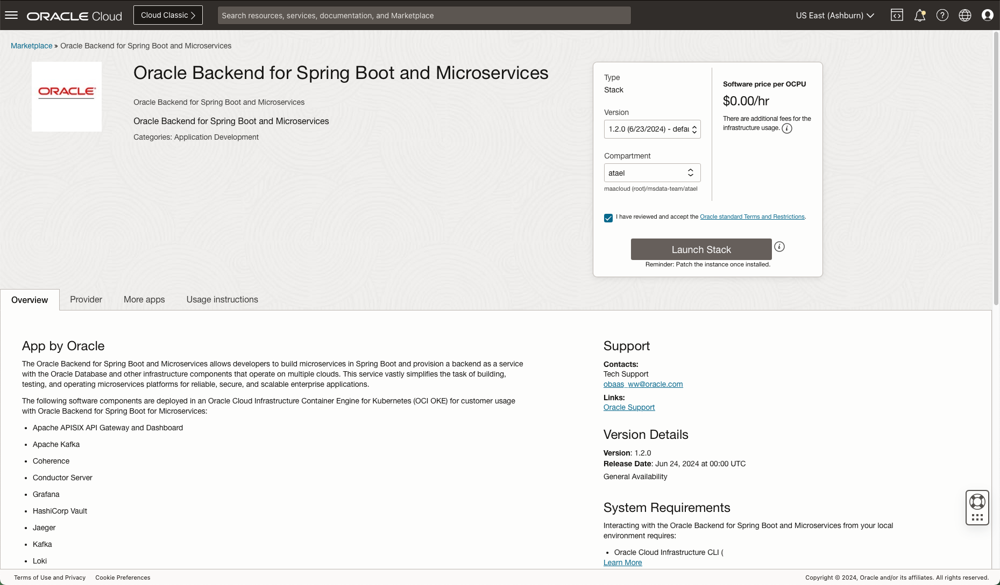

# Provision an instance of Oracle Backend for Spring Boot

## Introduction

This lab walks you through the steps to provision an instance of the Oracle Backend for Spring Boot, including Parse Platform in the Oracle Cloud. The Oracle Backend for Parse Platform is available separately, or it can be optionally included when installing the Oracle Backend for Spring Boot by selecting an option during the installation.

Estimated Time: 25 minutes

Quick walk through on how to provision an instance of Oracle backend for Spring Boot.

[](videohub:1_cc0jjaft)

### About Oracle Backend for Spring Boot

Oracle Backend for Spring Boot allows developers to build microservices in Spring Boot and provision a backend as a service with the Oracle Database and other infrastructure components that operate on multiple clouds. This service vastly simplifies the task of building, testing, and operating microservices platforms for reliable, secure, and scalable enterprise applications.

### About Oracle Backend for Parse Platform

Oracle Backend for Parse Platform allows developers to build and deploy mobile applications using Parse mobile APIs, and provision a backend as a service with the Oracle Database and other infrastructure components that operate on multiple clouds. This service vastly simplifies the task of building, testing, and operating a mobile app dev platform for reliable, secure, and scalable enterprise applications. This version includes an Oracle Database storage adapter for Parse (Parse already has MongoDB and Postgres adapters), and a proof of concept of Google Firebase APIs emulated using Parse APIs.

### Objectives

In this lab, you will:

* Provision an instance of Oracle Backend for Spring Boot, with Parse Platform included

### Prerequisites

This lab assumes you have:

* An Oracle Cloud account in a tenancy with sufficient quota and privileges to create:
  * An OCI Container Engine for Kubernetes cluster, plus a node pool with three worker nodes
  * A VCN with at least two public IP’s available
  * A public load balancer
  * An Oracle Autonomous Database - Shared instance
  * At least one free OCI Auth Token (note that the maximum is two per user)

## Task 1: Install the Oracle Backend for Spring Boot from OCI Marketplace

The Oracle Backend for Spring Boot can be installed from OCI Marketplace.

> **Note:** Oracle Backend for Spring Boot can also be installed on-premises or in other clouds.

1. Access the Oracle Cloud Infrastructure Marketplace listing

    Open the [OCI Marketplace listing](https://cloudmarketplace.oracle.com/marketplace/en_US/listing/138899911), as shown in the image below:

    

    Click on the **Get App** button.

1. Log into your Oracle Cloud Infrastructure account

    You will be taken to a Sign In page. Choose they type of account you have and click on the **Sign In** button. If you did not create an account in the **Get Started** lab, you can do so now using the **Sign Up** button.

    

    Sign into your account as you normally do, using Single Sign-On or Direct Sign-In.

1. Choose the region and compartment

    In the next screen you can choose the region using the pulldown in the top right hand corner, and then choose the compartment you want to install into.

    

    Review the terms and restrictions, and then click on the checkbox to accept them. Then, click on **Launch Stack**,

    > **Note:** This Live Lab is tested with **version 0.3.1**. Later versions should work, but earlier versions do not contain all features used in this Live Lab.

1. Review the **Create Stack** page

    Review the details on the **Create Stack** page. You may wish to update the **Name** or add tags. When you are ready, click on **Next**.

    

1. Complete the **Variables** page

    Review the details on the **Variables** page. You can set the **Application Name** or if you leave the field blank an auto generated application name is used (random pet names are used).

    

    In the **Parse Server** section, you _must_ check **Enable Parse Platform** for this Live Lab. The mobile application lab uses this feature. You can provide an **Application ID** if you like. Enter a username and password for the Parse Dashboard. Make a note of these details - you will need them later.

    

    Scroll down the the **Vault** section. If you check **Enable Vault**, an OCI Vault will created for the stack (the OCI Vault is used for auto unsealing the HashiCorp Vault). **Note** that OCI Vaults can be a limited resource in some tenancies, and they take 14 days to delete. So you may wish to reuse an existing OCI Vault, or opt out of OCI Vault for this installation. When you are ready, click on **Next**.

    > **Important**: If you leave the **Enable Vault** unchecked you will still get a HashiCorp Vault deployed into your Kubernetes cluster but in **Development Mode**. In this mode, Vault runs entirely in-memory, which **never** should be used in production mode.

    

1. Complete the **Review** page

    Review the details on the **Review** page. Check the box next to **Run Apply**. When you are ready, click on **Create**.

    

1. Review the apply screen

    The stack will now be applied. On the **Apply** screen (see below) you can monitor the progress of the installation in the **Logs** box. The installation should take about 20 - 25 minutes to complete. This includes the time needed to create your Oracle Autonomous Database instance, your Oracle Container Engine for Kubernetes cluster and install the various components of the stack into the Kubernetes cluster.

    

     > **Note**: While you are waiting for the installation to complete is a great time to start setting up your development environment (see the next lab). You can come back here where you are done to check the installation completed successfully.

## Task 2: Confirm the installation was successful

1. Check the logs for errors

    Scroll down to the bottom of the log to see the outcome. If there was an error during installation, details will be included at the end of the log. The most common errors are due to insufficient quota for some resource. If you get an error about insufficient quota, you may need to clean up unused resources or request a quota increase for the affected resource. Once you have done that, navigate back to the stack details (for example, using the breadcrumbs) and click on the **Apply** to try again.

    When the installation completes normally, the end of the log should look something like this:

    ```text
    Apply complete! Resources: 91 added, 0 changed, 0 destroyed.
    Outputs:
    kubeconfig_cmd = "oci ce cluster create-kubeconfig --cluster-id ocid1.cluster.oc1.phx.xxxx --file $HOME/.kube/config --region us-phoenix-1 --token-version 2.0.0 --kube-endpoint PUBLIC_ENDPOINT" 
    parse_application_id = "oLvYNyDIXgeYlmuBg3V1v7tvcXIFF8kj1IrQADkr"
    parse_dashboard_password = <sensitive>
    parse_dashboard_uri = "http://100.20.30.40/parse-dashboard"
    parse_dashboard_user = "ADMIN"
    parse_endpoint = "100.20.30.40/parse"
    parse_master_key = <sensitive>
    ```

    You can also get the values by clicking on the **Outputs** menu:

    

    > **Note**: Keep a copy of the addresses and keys, you will need these in later labs.

1. Verify you can access the Kubernetes cluster

    In later labs, you will look at various resources in Kubernetes. You will need a Kubernetes configuration file to access the cluster. For now, accessing the cluster from OCI Cloud Shell will be sufficient to verify the installation.

    Open the OCI Cloud Shell by clicking on the icon next to the region in the top right corner of the console and then clicking on **Cloud Shell**.

    

    Run the command provided at the end of your installation log to obtain the Kubernetes configuration file.  The command will be similar to this:

    ```shell
    <copy>oci ce cluster create-kubeconfig --cluster-id ocid1.cluster.oc1.phx.xxxx --file path/to/kubeconfig --region us-phoenix-1 --token-version 2.0.0 --kube-endpoint PUBLIC_ENDPOINT</copy>
    ```

    Set the **KUBECONFIG** environment variable to point to the file you just created using this command (provide the path to where you created the file):

    ```shell
    $ <copy>export KUBECONFIG=/path/to/kubeconfig</copy>
    ```

    Check that you can access the cluster using this command:

    ```shell
    $ <copy>kubectl get pods -n obaas-admin</copy>
    NAME                          READY   STATUS    RESTARTS     AGE
    obaas-admin-bf4cd5f55-z54pk   2/2     Running   2 (9d ago)   9d
    ```

    Your output will be slightly different, but you should see one pod listed in the output.  This is enough to confirm that you have correctly configured access to the Kubernetes cluster.

1. Verify you can connect to the APISIX API Gateway

    You will need to provide the correct IP address for the API Gateway in your backend environment.  You can find the IP address using this command, you need the one listed in the `EXTERNAL-IP` column:

    ```shell
    $ <copy>kubectl -n ingress-nginx get service ingress-nginx-controller</copy>
    NAME                       TYPE           CLUSTER-IP      EXTERNAL-IP   PORT(S)                      AGE
    ingress-nginx-controller   LoadBalancer   10.123.10.127   100.20.30.40  80:30389/TCP,443:30458/TCP   13d
    ```

    Now use this command (with your IP address) to make a request to the API Gateway.  You should receive a response with an HTTP Status Code 404 (Not Found) and an error message in JSON format as shown below.  Don't worry about the 404, you will deploy some services soon, but this test is enough to know the API Gateway started up successfully:

    ```shell
    $ <copy>curl -i http://100.20.30.40</copy>
    HTTP/1.1 404
    Date: Wed, 01 Mar 2023 19:21:08 GMT
    Content-Type: application/json
    Transfer-Encoding: chunked
    Connection: keep-alive
    Vary: Origin
    Vary: Access-Control-Request-Method
    Vary: Access-Control-Request-Headers
    
    {"timestamp":"2023-03-01T19:21:08.031+00:00","status":404,"error":"Not Found","path":"/"}
    ```

1. Verify you can connect to the Parse Dashboard

    Open a web browser to the Parse Dashboard address that was given at the end of your apply log, for example `http://100.20.320.40:1337`.  You can login to the dashboard with the username `ADMIN` (that's case sensitive) and the password you specified during the installation.  Once you are logged in, you will be able to see the application name you specified during installation.  If you did not specify a name, you will see a randomly generated name instead.  Click on that name to view the objects in that application.  There will just be the User, Session and Role classes there currently.

    

    This completes the verification process.  Later you will use several other web user interfaces to manage applications in the Oracle Backend for Spring Boot.

## Learn More

* [Oracle Backend for Spring Boot](https://oracle.github.io/microservices-datadriven/spring/)
* [Oracle Backend for Parse Platform](https://oracle.github.io/microservices-datadriven/mbaas/)

## Acknowledgements

* **Author** - Mark Nelson, Andy Tael, Developer Evangelist, Oracle Database
* **Contributors** - [](var:contributors)
* **Last Updated By/Date** - Andy Tael, June 2023
