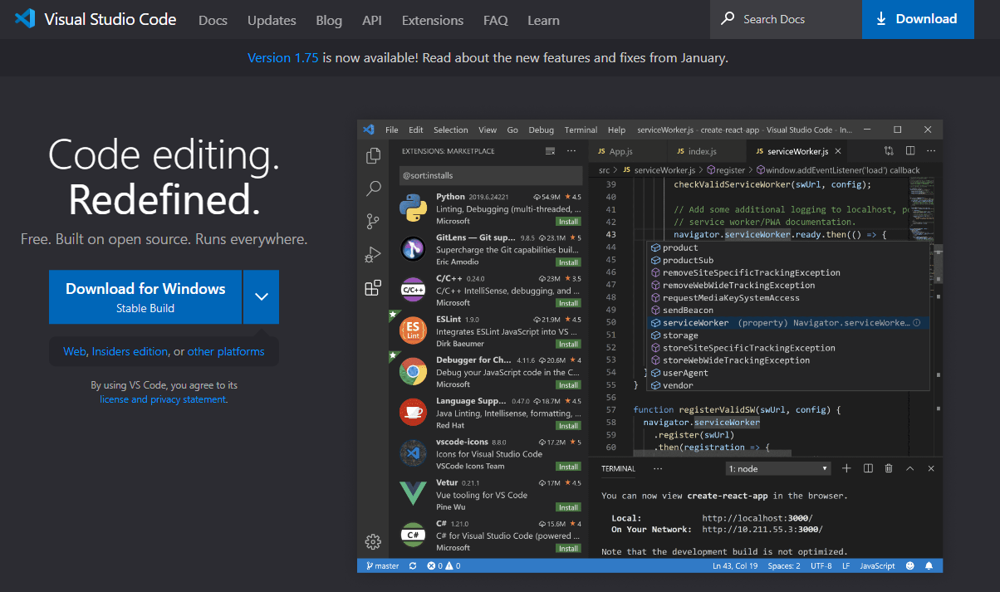
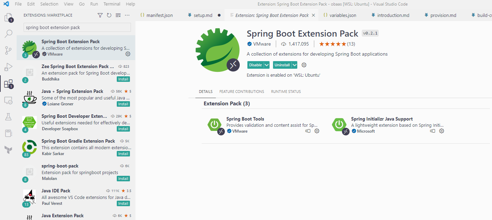
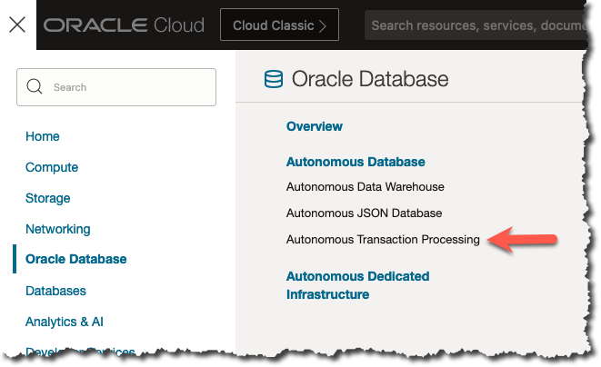
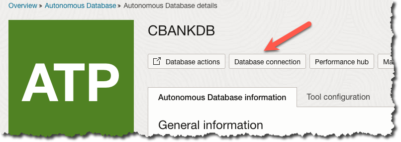
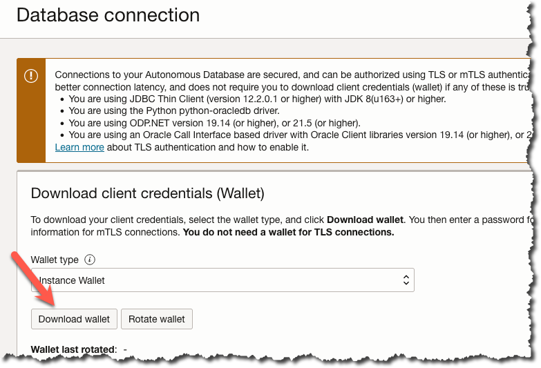
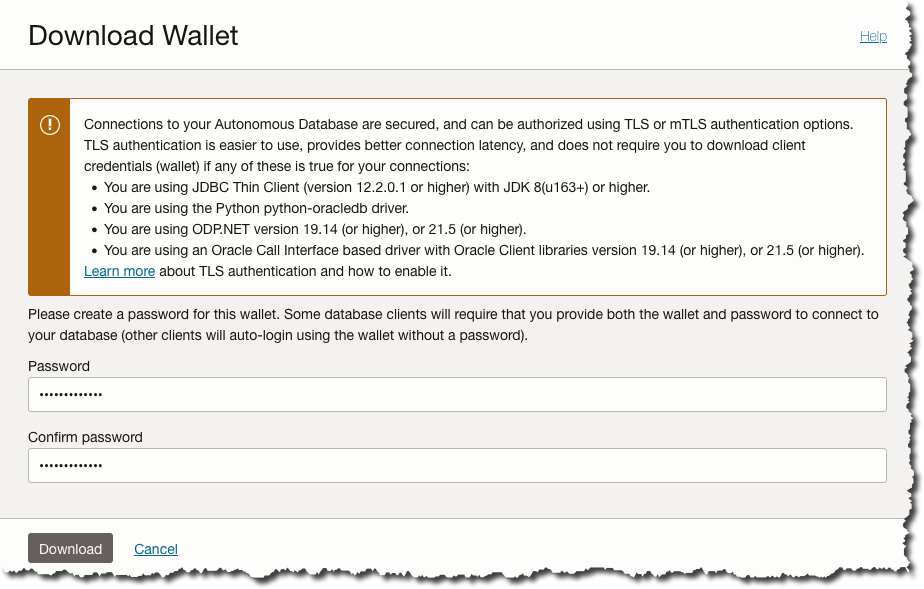
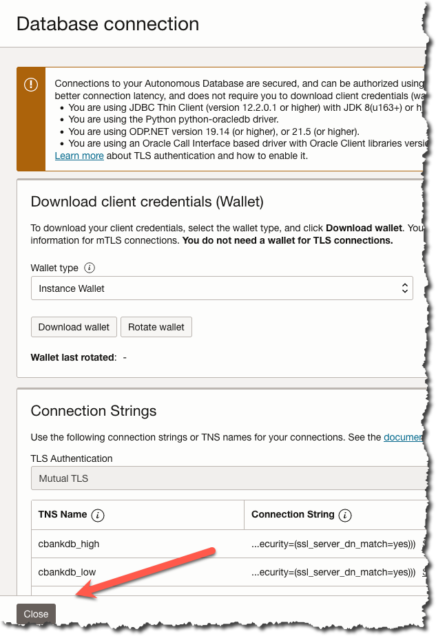
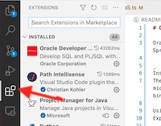
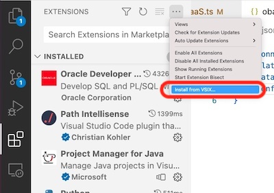
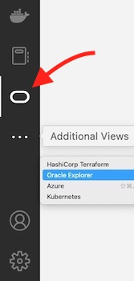

# Setup your Development Environment

## Introduction

This lab walks you through setting up your development environment to work with Oracle Backend for Spring Boot.

Estimated Lab Time: 20 minutes

Quick walk through on how to setup your development environment.

[](videohub:1_7jlh626t)

### Recommended Development Environment platforms and tools

The following platforms are recommended for a development environment:

- Windows 10 or 11, preferably with Windows Subsystem for Linux 2
- macOS (11 or later recommended) on Intel or Apple silicon
- Linux, e.g., Oracle Linux, Ubuntu, etc.

The following tools are recommended for a development environment:

- Integrated Development Environment, e.g., Visual Studio Code
- Java Development Kit, e.g., Oracle, OpenJDK, or GraalVM
- Maven or Gradle for build and testing automation

If you wish to test locally or offline, the following additional tools are recommended:

- A container platform, e.g., Rancher Desktop
- An Oracle Database (in a container). If you are using a Apple Silicon environment you can't run the Oracle Database locally. One alternative is to use an ADB in Oracle OCI.

### Objectives

In this lab, you will:

- Install the tools needed to develop and deploy applications using Oracle Backend for Spring Boot
- (Optional) Install the tools needed to develop mobile and/or web applications using Oracle Backend for Spring Boot (including Parse Platform)

### Prerequisites

This lab assumes you have:

- One of the recommended platforms, as listed above

## Task 1: Install the Integrated Development Environment

   Oracle recommends Visual Studio Code, which you can download [here](https://code.visualstudio.com/), and the following extensions to make it easier to write and build your code:

   - [Spring Boot Extension Pack](https://marketplace.visualstudio.com/items?itemName=pivotal.vscode-boot-dev-pack)
   - [Extension Pack for Java](https://marketplace.visualstudio.com/items?itemName=vscjava.vscode-java-pack)
   - [Oracle Developer Tools](https://marketplace.visualstudio.com/items?itemName=Oracle.oracledevtools)

   > **Note**: It is possible to use other Integrated Development Environments however all of the instructions in this Live Lab are written for and tested with Visual Studio Code, so we recommend that you use it for this Live Lab.

1. Download and install Visual Studio Code

   Download Visual Studio Code from [this web site](https://code.visualstudio.com/) and run the installer for your operating system to install it on your machine.

   

2. Install the recommended extensions

   Start Visual Studio Code, and then open the extensions tab (Ctrl-Shift-X or equivalent) and use the search bar at the top to find and install each of the extensions listed above.

   

## Task 2: Install a Java Development Kit

   Oracle recommends the [Java SE Development Kit](https://www.oracle.com/java/technologies/downloads/#java17).
   If you are using Spring Boot version 2.x, then Java 11 is recommended.
   If you are using Spring Boot version 3.x, then Java 17 is recommended, note that Spring Boot 3.0 requires at least Java 17.

   Even if you are using Spring Boot 2.x, Oracle encourages you to use at least Java 17, unless you have a specific reason to stay on Java 11.

1. Download and install the Java Development Kit

   Download the latest x64 Java 17 Development Kit from [this permalink](https://download.oracle.com/java/17/latest/jdk-17_linux-x64_bin.tar.gz).

   Decompress the archive in your chosen location, e.g., your home directory and then add it to your path:

    ```shell
    <copy>
    export JAVA_HOME=$HOME/jdk-17.0.3
    export PATH=$JAVA_HOME/bin:$PATH</copy>
    ```

2. Verify the installation

   Verify the Java Development Kit is installed with this command:

    ```shell
    $ <copy>java -version</copy>
    java version "17.0.3" 2022-04-19 LTS
    Java(TM) SE Runtime Environment (build 17.0.3+8-LTS-111)
    Java HotSpot(TM) 64-Bit Server VM (build 17.0.3+8-LTS-111, mixed mode, sharing)
    ```

    > **Note: Native Images:** If you want to compile your Spring Boot microservices into native images, you must use GraalVM, which can be downloaded [from here](https://www.graalvm.org/downloads/).

## Task 3: Install Maven

You can use either Maven or Gradle to build your Spring Boot applications. If you prefer Maven, follow the steps in this task.  If you prefer Gradle, skip to the next task instead.

1. Download Maven

   Download Maven from the [Apache Maven website](https://maven.apache.org/download.cgi).  

2. Install Maven

   Decompress the archive in your chosen location, e.g., your home directory and then add it to your path:

    ```shell
    $ <copy>export PATH=$HOME/apache-maven-3.8.6/bin:$PATH</copy>
    ```

3. Verify installation

   You can verify it is installed with this command (note that your version may give slightly different output):

    ```shell
    $ <copy>mvn -v</copy>
    Apache Maven 3.8.6 (84538c9988a25aec085021c365c560670ad80f63)
    Maven home: /home/mark/apache-maven-3.8.6
    Java version: 17.0.3, vendor: Oracle Corporation, runtime: /home/mark/jdk-17.0.3
    Default locale: en, platform encoding: UTF-8
    OS name: "linux", version: "5.10.102.1-microsoft-standard-wsl2", arch: "amd64", family: "unix"
    ```

## Task 4: Install Gradle (Optional)

If you prefer Gradle, follow the steps in this task.  

> **Note**:  All of the examples in this Live Lab use Maven.  We strongly recommend that you use Maven for this Live Lab.  

1. Download and install Gradle

   Download Gradle using [the instructions on the Gradle website](https://gradle.org/install/).  Spring Boot is compatible with Gradle version 7.5 or later.

2. Verify the installation

   Run the command below to verify Gradle was installed correctly:

    ```shell
    $ <copy>gradle -v</copy>
       
    ------------------------------------------------------------
    Gradle 7.6
    ------------------------------------------------------------
       
    Build time:   2022-11-25 13:35:10 UTC
    Revision:     daece9dbc5b79370cc8e4fd6fe4b2cd400e150a8
       
    Kotlin:       1.7.10
    Groovy:       3.0.13
    Ant:          Apache Ant(TM) version 1.10.11 compiled on July 10 2021
    JVM:          17.0.3 (Oracle Corporation 17.0.3+8-LTS-111)
    OS:           Linux 5.10.102.1-microsoft-standard-WSL2 amd64
    ```

## Task 5: Install the Oracle Backend for Spring Boot CLI

The Oracle Backend for Spring Boot CLI is used to configure your backend and to deploy your Spring Boot applications to the backend.

1. Download the Oracle Backend for Spring Boot CLI

   Download the CLI from [here](https://github.com/oracle/microservices-datadriven/releases/tag/OBAAS-1.0.0)

2. Install the Oracle Backend for Spring Boot CLI

   To install the CLI, you just need to make sure it is executable and add it to your PATH environment variable.

    ```shell
    <copy>
    chmod +x oractl
    export PATH=/path/to/oractl:$PATH</copy>
    ```

    **NOTE:** If environment is a Mac you need run the following command `sudo xattr -r -d com.apple.quarantine <downloaded-file>` otherwise will you get a security warning and the CLI will not work.

3. Verify the installation

  Verify the CLI is installed using this command:

    ```shell
    $ <copy>oractl version</copy>
       _   _           __    _    ___
      / \ |_)  _.  _. (_    /  |   |
      \_/ |_) (_| (_| __)   \_ |_ _|_
      Application Version: 0.3.1
      :: Spring Boot (v3.0.0) ::


      Build Version: 0.3.1
     ```

## Task 6: Install **kubectl** and the OCI CLI

In later labs, you will look various resources in the Kubernetes cluster and access some of them using port forwarding (tunneling).  To do this, you will need to install **kubectl** on your machine, and since Oracle Container Engine for Kubernetes uses token based authentication for **kubectl** access, you will also need to install the OCI CLI so that **kubectl** can obtain the necessary token.

1. Install **kubectl**

   Install **kubectl** from [the Kubernetes website](https://kubernetes.io/docs/tasks/tools/).  Click on the link for your operating system and follow the instructions to complete the installation.  As mentioned in the instructions, you can use this command to verify the installation, and you can ignore the warning since we are just checking the installation was successful (your output may be slightly different):

    ```shell
    $ <copy>kubectl version --client</copy>
    I0223 08:40:30.072493   26355 versioner.go:56] Remote kubernetes server unreachable
    WARNING: This version information is deprecated and will be replaced with the output from kubectl version --short.  Use --output=yaml|json to get the full version.
    Client Version: version.Info{Major:"1", Minor:"24", GitVersion:"v1.24.1", GitCommit:"3ddd0f45aa91e2f30c70734b175631bec5b5825a", GitTreeState:"clean", BuildDate:"2022-05-24T12:26:19Z", GoVersion:"go1.18.2", Compiler:"gc", Platform:"linux/amd64"}
    Kustomize Version: v4.5.4
    ```

2. Install the OCI CLI

   Install the OCI CLI from [the Quickstart documentation](https://docs.oracle.com/en-us/iaas/Content/API/SDKDocs/cliinstall.htm).  Click on the link for your operating system and follow the instructions to complete the installation.  After installation is complete, use this command to verify the installation (your output might be slightly different):

    ```shell
    $ <copy>oci --version</copy>
    3.23.2
    ```

3. Configure the OCI CLI

   Review the instructions [in the documentation](https://docs.oracle.com/en-us/iaas/Content/API/SDKDocs/cliconfigure.htm) for configuring the OCI CLI.  The simplest way to configure the CLI is to use the guided setup by running this command:

    ```shell
    $ <copy>oci setup config</copy>
    ```

   This will guide you through the process of creating your configuration file.  Once you are done, check that the configuration is good by running this command (note that you would have obtained the tenancy OCID during the previous step, and your output might look slightly different):

    ```shell
    $ <copy>oci iam tenancy  get --tenancy-id ocid1.tenancy.oc1..xxxxx</copy>
    {
      "data": {
        "description": "mytenancy",
        "freeform-tags": {},
        "home-region-key": "IAD",
        "id": "ocid1.tenancy.oc1..xxxxx",
        "name": "mytenancy",
        "upi-idcs-compatibility-layer-endpoint": null
      }
    }
    ```

## Task 7: Configure **kubectl** to access your Kubernetes cluster

At the end of the previous lab, during the verification of the installation, you looked at the end of the apply log and copied a command to obtain a Kubernetes configuration file to access your cluster.  In that lab, you used OCI CLoud Shell to confirm you could access the cluster.  Now, you need to configure similar access from your own development machine.   You can run that same command on your local machine, we recommend that you choose a different location for the file so it does not overwrite or interfere with any other Kubernetes configuration file you might already have on your machine.

1. Create the Kubernetes configuration file

   Run the command provided at the end of your installation log to obtain the Kubernetes configuration file.  The command will be similar to this:

    ```shell
    $ <copy>oci ce cluster create-kubeconfig --cluster-id ocid1.cluster.oc1.phx.xxxx --file path/to/kubeconfig --region us-phoenix-1 --token-version 2.0.0 --kube-endpoint PUBLIC_ENDPOINT</copy>
    ```

2. Configure **kubectl** to use the Kubernetes configuration file you just created

   Set the **KUBECONFIG** environment variable to point to the file you just created using this command (provide the path to where you created the file):

    ```shell
    $ <copy>export KUBECONFIG=/path/to/kubeconfig</copy>
    ```

3. Verify access to the cluster

   Check that you can access the cluster using this command:

    ```shell
    $ <copy>kubectl get pods -n obaas-admin</copy>
    NAME                          READY   STATUS    RESTARTS     AGE
    obaas-admin-bf4cd5f55-z54pk   2/2     Running   2 (9d ago)   9d
    ```

   Your output will be slightly different, but you should see one pod listed in the output.  This is enough to confirm that you have correctly configured access to the Kubernetes cluster.

## Task 8: Install **SQLcl**

1. (Optional) Install SQLcl

   If you do not already have a database client, [Oracle SQL Developer Command Line (SQLcl)](https://www.oracle.com/database/sqldeveloper/technologies/sqlcl/) is a free command line interface for Oracle Database which includes great features like auto-completion and command history. All the Labs are using SQLcl as the database client.

   If you choose to use SQLcl make sure it is in your `PATH` variable:

      ```shell
      <copy>export PATH=/path/to/sqlcl:$PATH</copy>
      ```

## Task 9: Getting Database Access

The Oracle Backend for Spring Boot includes an Oracle Database. An instance of an Oracle Autonomous Database (Shared) is created during installation.

To access the database from a local machine you need to download the wallet and configure `SQLcl` to use the downloaded wallet.

### Download the Wallet

1. Login into the OCI Console. [Oracle Cloud](https://cloud.oracle.com/)

1. Navigate to Autonomous Transaction Processing.

   

1. Make sure that you have the right compartment selected and click on the database name. The database name is composed  by the application name you gave during install with the suffix of `DB`. In the picture below the Application Name is `CBANK` so the database name is `CBANKDB`. If you didn't provide an Application name, the database will name will be a random pet name with the suffix `DB` in the compartment you deployed application.

   

1. Click Database Connection to retrieve the Wallet.

   

1. Click Download Wallet to download the Wallet.

   

1. You will need to provide a password for the Wallet. Make a note of where the wallet is located you'll be needing it when connection to the Database.

   

1. Close the Database Connection Dialog Box

   

### Access the Database using SQLcl and the Wallet

1. Obtain the ADMIN password

    To get the ADMIN password for the database you need to read a k8s secret. Replace the `cbankdb` with the Database name for you deployment in the command below. The name is composed by the Application Name you gave during deployment with the suffix `DB`. If you didn't provide an Application name, the database will name will be a random pet name with the suffix `DB` in the compartment you deployed application. Get the password using this command:

    ```shell
    $ <copy>kubectl -n application get secret cbankdb-db-secrets -o jsonpath='{.data.db\.password}' | base64 -d</copy>
     ```

1. Start `SQLcl` and connect to the Database:

    Start SQLcl using the following command:

    ```shell
    $ <copy>sql /nolog</copy>


    SQLcl: Release 22.4 Production on Fri Mar 03 10:33:33 2023

    Copyright (c) 1982, 2023, Oracle.  All rights reserved.

    SQL>
    ```

    Run the following command to load the wallet. Make sure you use the right location and name of the wallet

    ```sql
    SQL> <copy>set cloudconfig /path/to/wallet/wallet_name.zip</copy>
    ```

    Display the TNS Entries by executing the following command. The TNS Entries will be different for your deployment.

    ```sql
    SQL> <copy>show tns</copy>
    CLOUD CONFIG set to: /path/to/wallet/wallet_name.zip

    TNS Lookup Locations
    --------------------

    TNS Locations Used
    ------------------
    1. /path/to/wallet/wallet_name.zip
    2.  /Users/atael

    Available TNS Entries
    ---------------------
    CBANKDB_HIGH
    CBANKDB_LOW
    CBANKDB_MEDIUM
    CBANKDB_TP
    CBANKDB_TPURGENT
    SQL>
    ```

    Connect to the Database using this command. Replace the `ADMIN-PASSWORD` with the password obtained from the k8s secret and replace `TNS-ENTRY` with your database name followed by `_TP`. In this example it would be `CBANKDB_TP`

    ```sql
    SQL> connect ADMIN/ADMIN-PASSWORD@TNS-ENTRY
    Connected.
    ```

    You can now close the connection or leave it open as you are going to need it in later Labs.

## (Optional) Task 10: Install Flutter

If you plan to complete the Mobile App Development lab, you will need to install Flutter.  This is not required if you are only going to complete the Spring Boot labs.

1. Install Flutter

   Visit the [Flutter installation page](https://docs.flutter.dev/get-started/install) and click on your platform.  Follow the instructions to download and install the Flutter SDK, and run Flutter Doctor to identify and resolve any issues.

   Make sure you also install the Visual Studio extension.

2. (Optional) Install Android Studio or XCode

   The CloudBank sample application that you will extend in the last lab can run on Android or iOS devices, or just in a web browser on your computer.  If you want to run it in a web browser, nothing more is needed.

   If you prefer to run the application in a device emulator (or on a real device) you will need to install Android Studio, or XCode.  Follow the instructions on the Flutter installation page (the same page you just used to install the Flutter SDK) to install your chosen IDE and emulator.

   If you are installing Android Studio or XCode for the first time, you should also follow the instructions to create a device emulator instance.

## (Optional) Task 11: Oracle Backend for Spring Boot VS Code plugin

If you plan to do the optional part of Lab. 5, you need to install in VS Code the Oracle Backend for Spring Boot VS Code plugin. It is an extension to browse and deploy applications on the Oracle Backend for Spring Boot platform. This plugin allows to inspect the content of an Oracle Backend for Spring Boot deployment, in terms of applications, services and related configurations.

1. Download the plug-in from [here](https://github.com/oracle/microservices-datadriven/releases/tag/OBAAS-1.0.0).

2. On the VS Code right menu bar, click on **Extensions** item:

    

3. From the up-right corner menu, choose **Install from VSIX...**:

    

   and upload plug-in binaries previously downloaded.

4. Re-start VS Code to make fully operative the plugin, in command palette execute a window reload:

   

5. If you don't see the plugin in the left bar, with the Oracle logo, as shown here:

    

   click on **Additional Views** menu to select the **eBaaS Explorer**.

## Acknowledgements

* **Author** - Mark Nelson, Andy Tael, Developer Evangelist, Oracle Database
* **Contributors** - [](var:contributors)
* **Last Updated By/Date** - Andy Tael, June 2023
